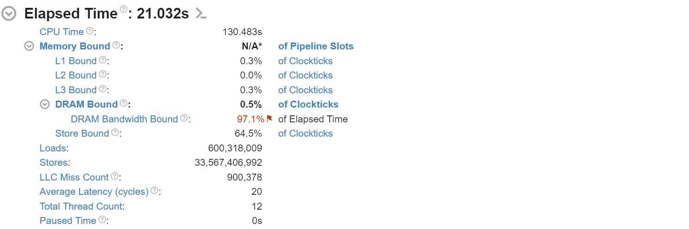

# Bandwidth Saturation Test

## Project Overview

The **Bandwidth Saturation Test** simulates memory saturation by utilizing multiple threads to continuously read and write from a large buffer, aiming to saturate the memory bus. This test collects throughput data (in MB/s) to evaluate the impact of high memory usage and to explore how memory bandwidth limitations can create a bottleneck in modern computer systems.

The test demonstrates the concept of memory bottlenecks, recalling the original Von Neumann architecture's limitation where the same data bus is shared for both instructions and data, affecting overall system performance.

### Expected Outcome

* The test is designed to show how memory throughput decreases when the memory bus becomes saturated.
* The test will simulate high memory usage and demonstrate how the limited bandwidth can impact overall performance.
* The results will show how multiple threads accessing the same buffer can cause contention, and how this contention is a result of the shared memory bus in a system architecture.

## Problem Description

Memory bandwidth saturation occurs when the rate at which data can be read from or written to DRAM reaches its limit. In multi-threaded applications, excessive memory operations can lead to contention, especially when memory access patterns are not optimized.

This test investigates how the available memory bandwidth is utilized and whether the system reaches the saturation point under increasing workloads.

## Example Output

```
Performance Results:
+--------------------------+-----------------+
| Metric                   | Value           |
+--------------------------+-----------------+
| Max Thread Throughput    |    4732.65 MB/s |
| Total Throughput         |   67496.45 MB/s |
| Theoretical Bandwidth    |   68160.00 MB/s |
| Efficiency               |      99.03 %    |
+--------------------------+-----------------+
```

As more threads are added, the throughput gradually decreases, illustrating the saturation of the memory bus.

## Explanation of Output

* **Max Thread Throughput**: The highest throughput achieved by any single thread.
* **Total Throughput**: Aggregate memory bandwidth used by all threads.
* **Theoretical Bandwidth**: Maximum expected throughput based on system specification.
* **Efficiency**: Ratio of achieved to theoretical bandwidth.

## Profiling with Intel VTune Profiler

Intel VTune Profiler was used to analyze memory bandwidth and bottlenecks. Below are key findings and visualizations:

### Bandwidth Utilization Histogram

This graph displays the wall time associated with DRAM bandwidth usage levels:


* Most of the execution time falls within **Low** bandwidth utilization.
* Indicates underutilization of memory bandwidth despite high thread count.

### DRAM Bound Analysis

Detailed view of memory-related stalls and loads:



* **85.7% of clockticks** are stalled due to **L1 and DRAM latency**.
* **0% DRAM Bandwidth Bound** suggests that throughput bottleneck is not due to raw bandwidth limits but likely due to **access patterns** or **latency**.

These results suggest the system is limited by access efficiency rather than absolute bandwidth availability. Optimization could include improving cache usage or reducing access contention.

## How to Compile and Run

### 1. Clone the Repository

```bash
git clone https://github.com/LyudmilaKostanyan/Bandwidth-Saturation-Test.git
cd Bandwidth-Saturation-Test
```

### 2. Build the Project

Use CMake to build the project:

```bash
cmake -S . -B build
cmake --build build
```

Ensure you have CMake and a C++ compiler (e.g., g++) installed.

### 3. Run the Program

#### For Windows Users

```bash
./build/main.exe
```

#### For Linux/macOS Users

```bash
./build/main
```